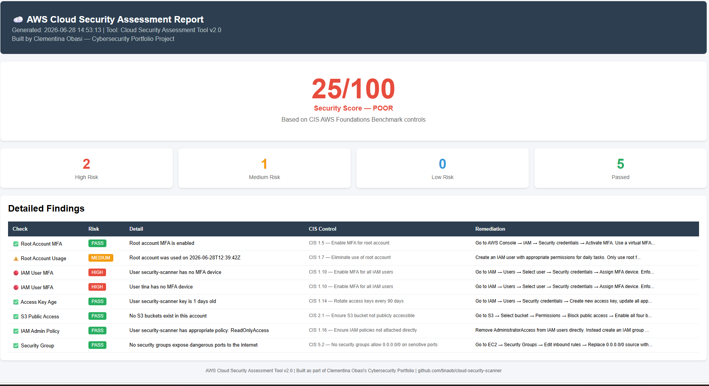

# AWS Cloud Security Assessment Tool v2.0 ☁️🔍

A Python tool that performs automated security assessments of AWS 
accounts, mapping findings to CIS AWS Foundations Benchmark controls, 
scoring overall security posture, and generating both JSON reports 
and a visual HTML dashboard.

---

## ⚠️ Legal Warning

Only scan AWS accounts you own or have explicit written permission 
to audit. Unauthorized scanning of cloud accounts is illegal.

---

## What Problem Does This Solve?

Cloud misconfiguration is the number one cause of data breaches 
in 2024-2026. This tool automates the security audit process, 
instantly flagging misconfigurations mapped to industry-standard 
CIS controls — resembling commercial Cloud Security Posture 
Management (CSPM) tools like Prisma Cloud and Wiz.

---

## What It Checks — 7 Security Controls

| Check | CIS Control | Risk if Failed |
|---|---|---|
| Root account MFA | CIS 1.5 | HIGH |
| Root account usage | CIS 1.7 | MEDIUM |
| IAM users without MFA | CIS 1.10 | HIGH |
| Access key rotation (90 days) | CIS 1.14 | HIGH |
| Overly permissive IAM policies | CIS 1.16 | HIGH |
| Security groups open to internet | CIS 5.2 | HIGH |
| S3 bucket encryption | CIS 2.2 | HIGH |
| S3 public access | CIS 2.1 | HIGH |

---

## Key Features

- **CIS Benchmark mapping** — every finding references its CIS AWS 
  Foundations Benchmark control number
- **Risk scoring** — calculates an overall security score out of 100
- **Severity classification** — HIGH, MEDIUM, LOW, PASS for every check
- **Remediation recommendations** — specific fix instructions for 
  every finding
- **HTML dashboard** — visual colour-coded security report
- **JSON report** — machine-readable output for integration with 
  other tools

---

## Example Output

---

## HTML Dashboard Preview

The tool generates a professional HTML dashboard showing:
- Overall security score out of 100
- Colour-coded finding cards (High/Medium/Low/Pass)
- Detailed findings table with CIS controls and remediation steps
- Built-in branding for portfolio presentation

---

## Real Findings From My Own AWS Account

Running this tool against my own AWS account found:

- **2 IAM users without MFA** — both flagged HIGH risk with exact 
  remediation steps referencing CIS 1.10
- **Root account used today** — flagged MEDIUM risk referencing CIS 1.7
- **Security Score: 25/100** — demonstrating the tool accurately 
  reflects real misconfiguration risk

These are genuine findings from a live AWS account — proving the 
tool works correctly in a real environment.

---

## Tools and Technologies Used

| Tool | Purpose |
|---|---|
| Python 3 | Core programming language |
| boto3 | AWS SDK — connects to IAM, S3, EC2 APIs |
| AWS IAM | User, policy and MFA scanning |
| AWS S3 | Public access and encryption checks |
| AWS EC2 | Security group rule analysis |
| AWS CLI | Authentication and credential management |
| CIS Benchmark | Industry standard control mapping |
| HTML/CSS | Dashboard generation |
| JSON | Structured report output |

---

## How to Run It Yourself

### 1. Create a free AWS account
Sign up at aws.amazon.com/free

### 2. Create an IAM user with ReadOnlyAccess
Never use your root account for scanning

### 3. Install AWS CLI and configure credentials

### 4. Clone this repository

### 5. Install Python dependency

### 6. Run the scanner

### 7. Open the HTML dashboard
The tool automatically generates an HTML file — open it in your 
browser to see the visual dashboard.

---

## What I Learned Building This

- How to connect Python to real AWS infrastructure using boto3
- How the CIS AWS Foundations Benchmark structures security controls 
  and why it is the industry standard for cloud security auditing
- Why MFA is the single most effective control against credential 
  compromise — most breaches involve valid credentials without MFA
- How commercial CSPM tools like Prisma Cloud and Wiz work at a 
  conceptual level — they automate exactly this kind of 
  control-by-control assessment at scale
- How risk scoring works in practice — translating multiple findings 
  into a single actionable number for management reporting
- Why remediation guidance matters as much as detection — finding 
  a problem without telling someone how to fix it has limited value

---

## Limitations and Future Improvements

- Currently scans one AWS account — future version will support 
  multi-account scanning across AWS Organizations
- Does not yet generate PDF reports — planned for next version
- Could add AI-generated plain-language explanations of each finding
- Could integrate with AWS Security Hub for continuous monitoring
- Future version will add email alerting for critical findings
- Could expand to 50+ CIS controls for full benchmark coverage

---

## Comparison to Commercial Tools

| Feature | This Tool | Prisma Cloud / Wiz |
|---|---|---|
| CIS benchmark mapping | ✅ | ✅ |
| Risk scoring | ✅ | ✅ |
| Remediation guidance | ✅ | ✅ |
| HTML dashboard | ✅ | ✅ |
| Multi-account | ❌ | ✅ |
| 500+ checks | ❌ | ✅ |
| Real-time monitoring | ❌ | ✅ |
| AI explanations | Planned | ✅ |

---

## Author

**Clementina Obasi**
Cybersecurity Analyst | CySA+ | CCNA CyberOps | Google Cybersecurity Certified
[LinkedIn](https://www.linkedin.com/in/clementina-obasi-b89a3381/)

---

*Built as part of my cybersecurity portfolio — June 2026*
*Version 2.0 — upgraded from basic scanner to full assessment tool*
